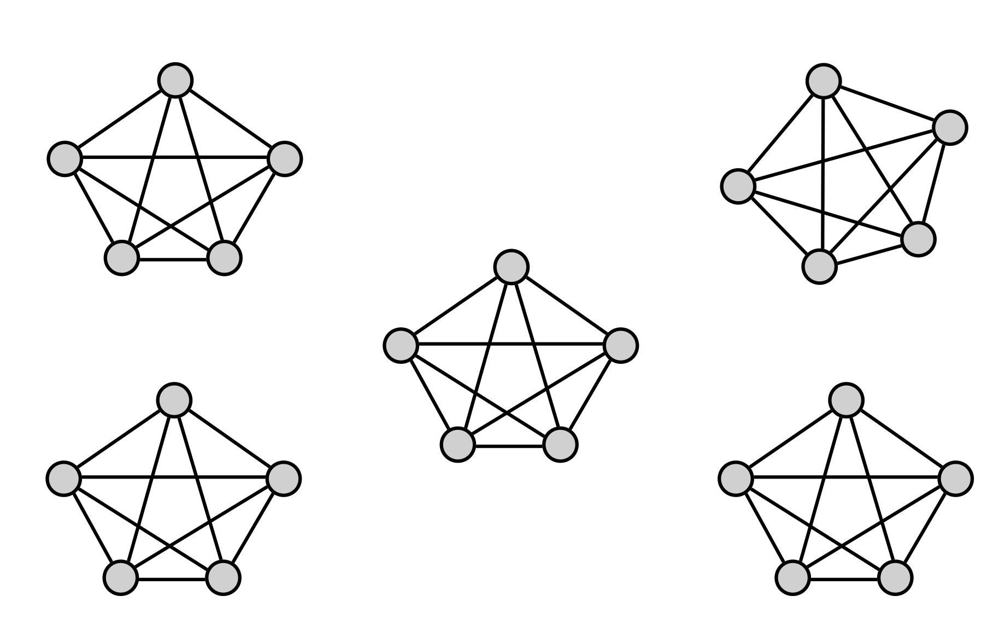

# QUACQ — Constraint Acquisition

Implementation of the **QUACQ algorithm** for **interactive constraint acquisition**.  
QUACQ learns the underlying constraints of a target problem by posing **queries** to an **oracle** (a user or simulated system).

**Original paper:** [QUACQ](https://hal.science/lirmm-04028358/)

---

## 🔍 Overview

**Supported Constraint Types**

| Type | Examples |
|------|-----------|
| Unary | `==val`, `!=val`, `<val`, `<=val`, `>val`, `>=val` |
| Binary | `==`, `!=`, `<`, `<=`, `>`, `>=` |
| Distance-based | `\|\|==val`, `\|\|!=val`, `\|\|<val`, `\|\|<=val`, `\|\|>val`, `\|\|>=val` |

---

## Key Concepts 

- **Variable:** A named item with a domain of possible values (e.g., `x ∈ [0,4]`).  
- **Domain:** The set of possible values for a variable.  
- **Constraint:** A rule relating one or more variables (e.g., `x != y`, `|x − y| ≤ 1`).  
- **Bias (B):** The set of candidate constraints the learner considers — its “hypothesis space.”  
- **Oracle / Target network:** The ground truth that answers whether an example satisfies the hidden constraints.  
- **Example:** An assignment giving each variable a value, e.g., `{x: 2, y: 3}`.

---

##  How QUACQ Works

1. Start with a **bias** (candidate constraints).  
2. Generate or query **examples** from the oracle.  
3. Use the oracle’s feedback to eliminate inconsistent constraints.  
4. Repeat until the learned set matches the oracle’s constraints.


For example, to learn the constraints of the Zebra puzzle, we can use QUACQ with a constraint target network 
the illustration below. represents the clicks of zebra problem where each clique in the graph represents a set of properties that should not occur in the same house.

<p align="center">  </p>

Using QUACQ, we can easily learn the structure of this problem —
see the example provided in the notebooks folder.

---

##  Getting Started

### 1 Installation
Clone the repository and install dependencies:

```bash
git clone https://github.com/yourusername/quacq.git
cd quacq
pip install -e .
```

### 2 Run an Example

The repository includes toy benchmarks (like **zebra**) to illustrate learning.

```bash
python -m QUACQ.cli.learn --benchmark zebra --output results
```

Results will be saved under `results/`, and logs under `logs/code/YYYY-MM-DD/`.


---

##  Project Structure

| Path | Description |
|------|--------------|
| `src/QUACQ/core.py` | Core classes: `Variable`, `Relation`, `Constraint`, `Bias`, `Target_Network`. |
| `src/QUACQ/acquisition.py` | Main QUACQ algorithm and helper functions (uses OR-Tools). |
| `src/QUACQ/cli/learn.py` | Command-line interface for experiments. |
| `src/benchmarks/` | Toy benchmarks (`zebra`, `jigsaw`, `murder`, `rflap`). |
| `tests/` | Unit tests demonstrating usage. |

---
